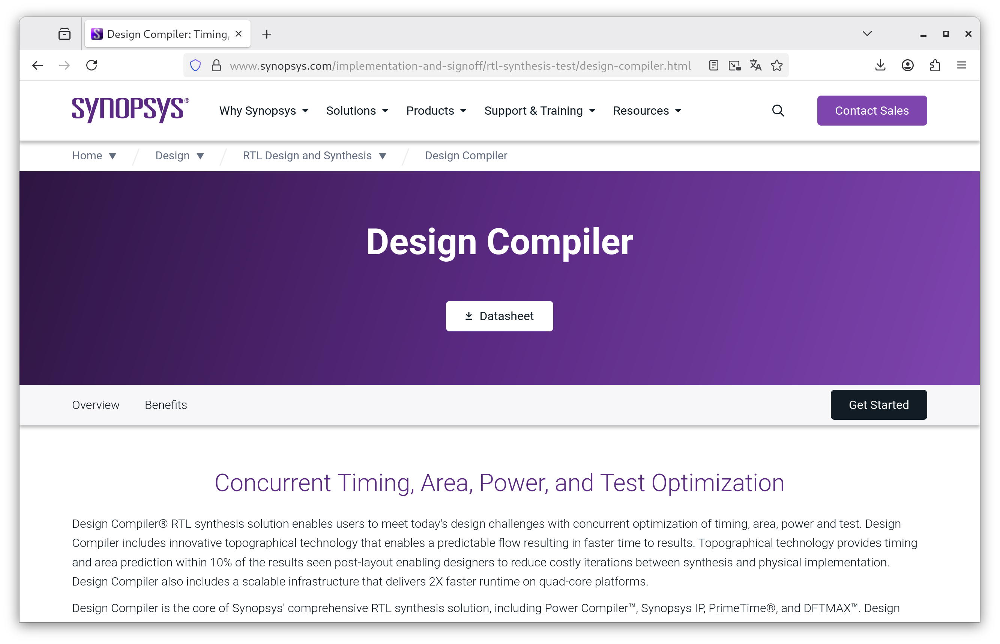
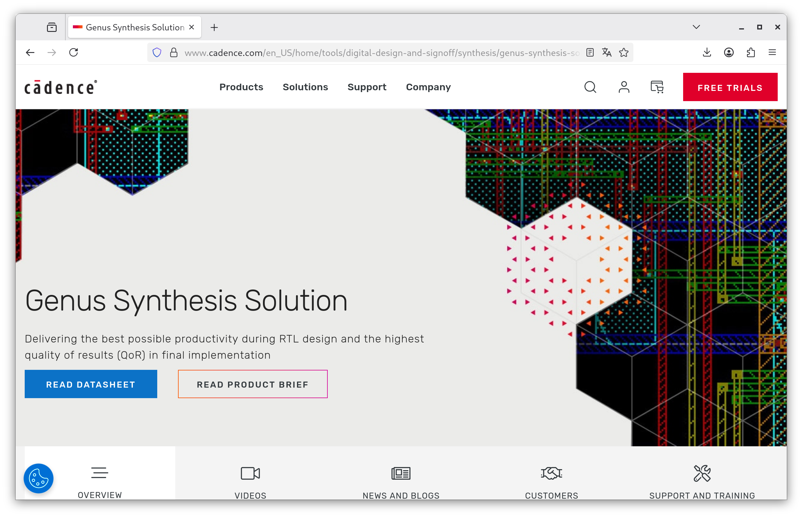
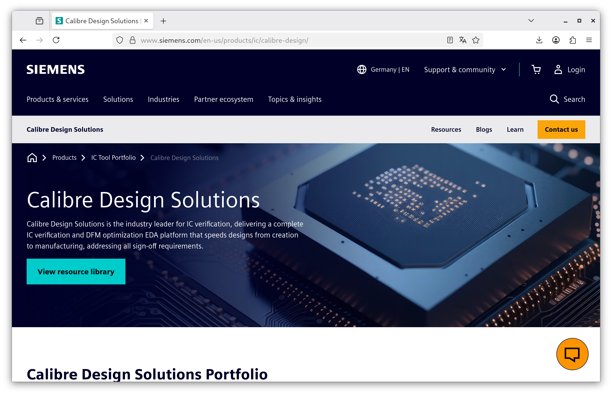
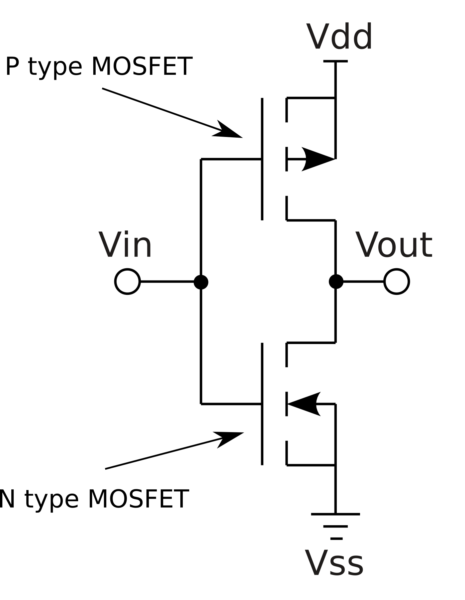
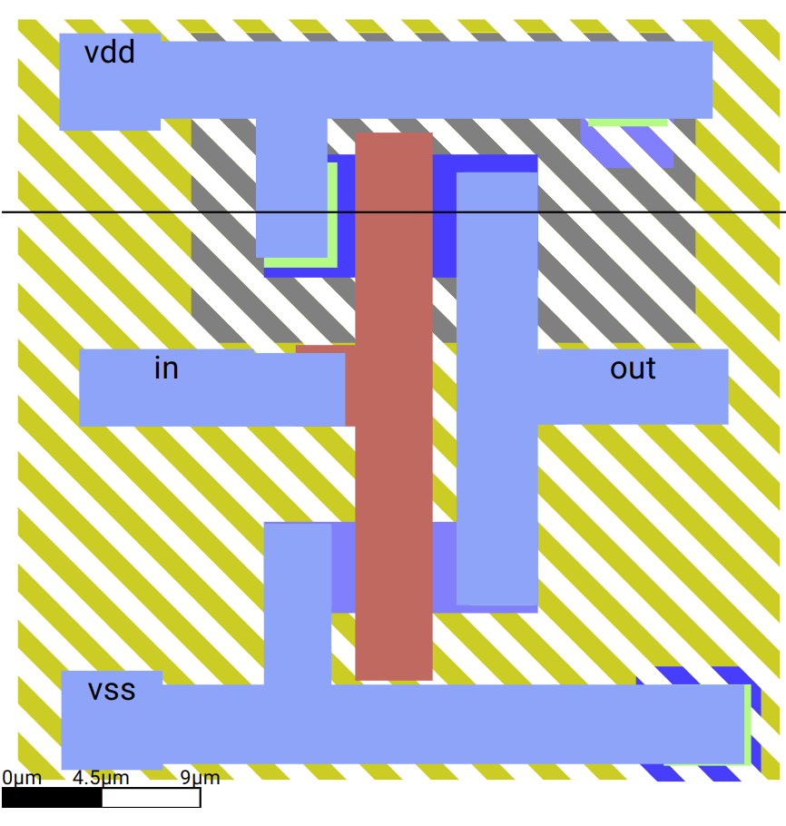
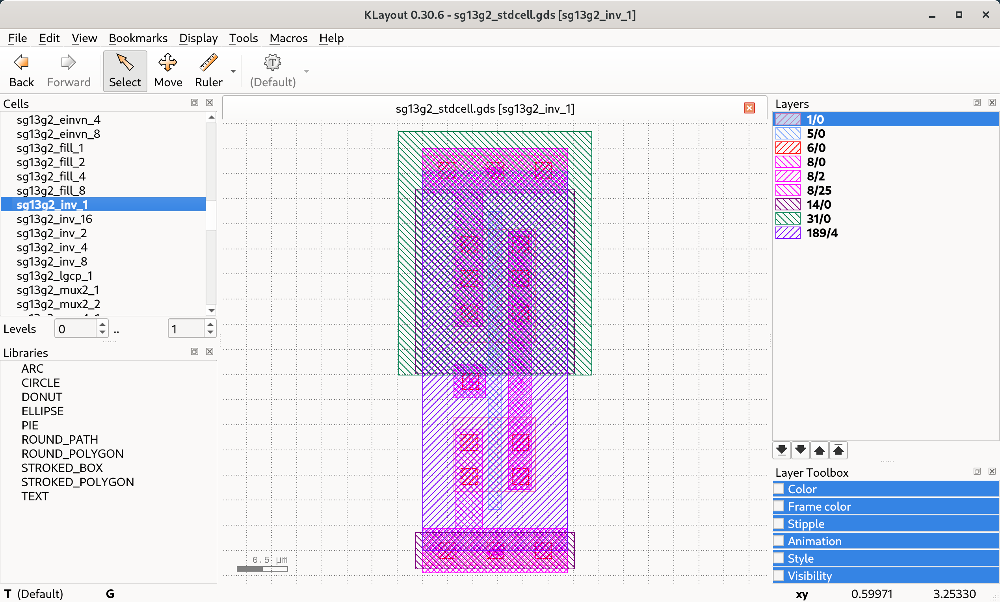
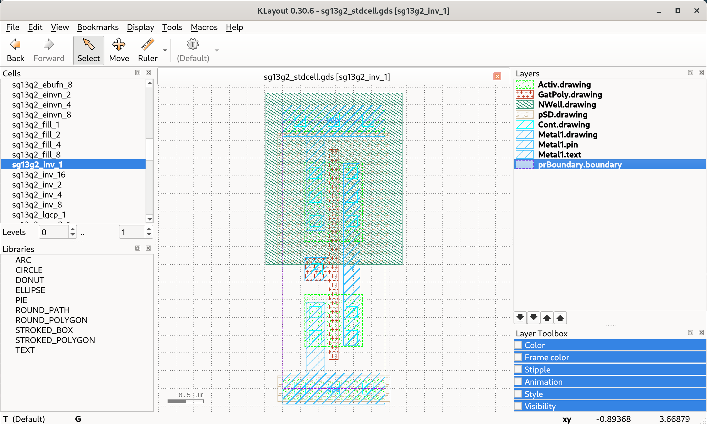

# Chapter 1 - Introduction and overview

## Welcome

### What we have done so far

- VHDL language introduction
- RTL Simulation with GHDL
- Synthesis for FPGA with Intel/Altera Quartus
- Basic circuits: Counter, Shiftregister, Statemachine
- Lab measurements with Terasic DE1 board

## Course overview

### Chapter names
 
::: columns

:::: {.column width=50%}

* 1 Introduction
* 2 OpenROAD tools
* 3 Verilog
* 4 OpenROAD first run

::::

:::: {.column width=50%}

* 5 PDK
* 6 OpenROAD GUI
* 7 OpenROAD flow scripts
* 8 Tapeout

::::

:::


### Get the course materials here:

Course materials (Release):

[https://github.com/fredowski/Course/releases](https://github.com/fredowski/Course/releases)

- Download the latest release
- Unpack into a directory
- There might be daily updates during the course!

### Additional course related links:

Master VLSI Wiki:

[https://www.hs-augsburg.de/homes/beckmanf/dokuwiki/doku.php?id=msvsli_start](https://www.hs-augsburg.de/homes/beckmanf/dokuwiki/doku.php?id=msvsli_start)

OpenROAD Flow Scripts:

[https://github.com/fredowski/OpenROAD-flow-scripts](https://github.com/fredowski/OpenROAD-flow-scripts)


### Duplicated content versus internet links

The course slides

- contain Links to the Internet for a lot of topics.
- do not contain duplicated content (or as less as possible).

This means:

- Follow the links and read there. It is important content for the course.
- The links are carefully curated. It's not spamming.
- Don't expect all the content beeing duplicated into the course slides.

## Open-source EDA for digital designs

### Digital designs

There are:

- **Digital designs** This course!
- Analog designs (Upcoming course)
- Mixed signal designs
- Artwork designs (i.e. Minimal Fab Contest)
    * [https://github.com/mineda-support/Semicon2023-MinimalFab-Design-Contest](https://github.com/mineda-support/Semicon2023-MinimalFab-Design-Contest)
- Your fancy design?

**From now on: This course means digital design, even if not mentioned everywhere again**

### From design to microchip


### RTL to GDS toolchain


### RTL: Register Transfer Level

![RTL (Screenshot from Wikipedia [^1])](pics_lecture/rtl_wikipedia.png)

[^1]: [https://en.wikipedia.org/wiki/Register-transfer_level](https://en.wikipedia.org/wiki/Register-transfer_level)


### GDS: Graphic Data System (II)

![GDS (Screenshot from Wikipedia [^2])](pics_lecture/gds_wikipedia.png)

[^2]: [https://en.wikipedia.org/wiki/GDSII](https://en.wikipedia.org/wiki/GDSII)

### The GDS II Format (Specifications)

Here are two links about the structure, format and elements of GDS II. The links are for reference reasons. It is not strictly necessary to read or learn the GDS II format for this course. But it might help understanding.

[https://boolean.klaasholwerda.nl/interface/bnf/gdsformat.html](https://boolean.klaasholwerda.nl/interface/bnf/gdsformat.html)

[https://www.rulabinsky.com/cavd/text/chapc.html](https://www.rulabinsky.com/cavd/text/chapc.html)

### Example of a GDS in KLayout


### Naming of RTL-to-GDS tools:

The naming of the tools is confusing:

- RTL-to-GDS 
- = RTL-2-GDS 
- = End-to-End-ASIC tools 
- = End-to-End EDA toolchain

They all mean the same.

### In this course: ORFS - OpenROAD flow scripts


### Many open-Source RTL-to-GDS toolchains

#####
Used with IHP PDK and in this course:

- [OpenROAD flow scripts](https://github.com/fredowski/OpenROAD-flow-scripts)

which is based on

- [OpenROAD](https://github.com/The-OpenROAD-Project/OpenROAD)

##### 
Most known other RTL-to-GDS toolchains:

- [OpenLANE](https://github.com/The-OpenROAD-Project/OpenLane) (based on OpenROAD)
- [OpenLANE 2](https://github.com/efabless/openlane2) (based on OpenROAD)
- [Silicon Compiler](https://www.siliconcompiler.com/) (works with many toolchains, close and open-source)
- [Coriolis](https://github.com/lip6/coriolis) (developed at University Sorbonne, LIP-6)

### A toolchain based on scripts and configuration files

OpenROAD flow scripts are

- based on scripts (obvious in the name)
- based on configuration files

Want most developers know from the commercial tools is:

- Graphical GUIs, used with a mouse and keyboard (shortcuts).
- Configuration through graphical masks, windows, forms.

This might feel uncomfortable at the beginning.
But it still has some advantages.

## About open-source EDA

### Advantages of open-source in EDA
* A word by Andrew Kahng (head of OpenROAD) about the relevance of open-source EDA

Andrews slides from the keynote speech at the Chipdesign Network June 2024. As the ucsd server is down, this is a link to the wayback machine:

[https://web.archive.org/web/20240609214401/https://vlsicad.ucsd.edu/NEWS24/InnovationKeynote-v6-ACTUAL-DISTRIBUTED.pptx](https://web.archive.org/web/20240609214401/https://vlsicad.ucsd.edu/NEWS24/InnovationKeynote-v6-ACTUAL-DISTRIBUTED.pptx)

##### Slides to have a eye on:

- Slide 06: EDA is an optimization problem
- Slide 10: Open-source EDA and disruptive Innovations
- Slide 13: Open-source accelerates EDA
- The complete chapter "Optimization and Virtuous Cycles" starting at slide 25
- Slides 39-43 about AI and proxies.

### Some aspects of open-source EDA

- Three well known PDKs are open-source and production-ready.
- Some other open-source PDKs are not that visible or prominent (MiniFab, Pragmatic(soon?), ...)
- More then one RTL-to-GDS toolchain is production tested.
- Academia starts teaching a lot with open-source EDA.
- Building microchips with open-source became easy and affordable.

- No NDAs, No licence costs, Start with a laptop and internet.

### What people have done with open-source EDA

- The following slides contain some works that were made with open-source EDA tools and open-source PDKs.
- All the pictures represent GDS data in different ways. 
- A few slides back a picture of GDS in KLayout was shown. The following GDS pictures were created with various other open-source tools (Blender, 3d prints, STL files, ...).
- Most of these works would not have been possible to integrate here in closed source (because of NDAs and licenses)
- Open-source EDA drives people to experiement and play with the technology.

###
![Tinytapeout GDS [^13]](pics_lecture/pics_os/tinytapeout_gds.png)

[^13]: Picture by T.Knoll under Creative commons

###
![Webviewer Tinytapeout zoomed out [^14]](pics_lecture/pics_os/webviewer_1.png)

[^14]: Picture by T.Knoll under Creative commons

###
![Webviewer Tinytapeout zoomed in [^15]](pics_lecture/pics_os/webviewer_2.png)

[^15]: Picture by T.Knoll under Creative commons

###
![Webviewer Tinytapeout single cell [^16]](pics_lecture/pics_os/webviewer_3.png)

[^16]: Picture by T.Knoll under Creative commons

### Webviewer of Tinytapout designs with the IHP PDK

See a TinyTapeout design (VGA clock by Matt Venn) in a 3D viewer:

[https://tinytapeout.com/runs/ttihp0p2/tt_um_vga_clock](https://tinytapeout.com/runs/ttihp0p2/tt_um_vga_clock)

It is made with the IHP open-source PDK.

### Tinytapeout Demoscene Competition

Tinytapeout competition to produce a VGA screen and sound demo with around 4000 gates.

[https://tinytapeout.com/competitions/demoscene-tt08-winners/](https://tinytapeout.com/competitions/demoscene-tt08-winners/)

[https://www.a1k0n.net/2025/12/19/tiny-tapeout-demo.html](https://www.a1k0n.net/2025/12/19/tiny-tapeout-demo.html)

It is made with the SkyWater 130nm open-source PDK.

### Siliwiz - How do semiconductors work?

Play with Siliwiz or take the lessons:

[https://tinytapeout.com/siliwiz/introduction/](https://tinytapeout.com/siliwiz/introduction/)

[https://app.siliwiz.com/](https://app.siliwiz.com/)

### Commercial EDA - Synopsys Design Compiler

[https://www.synopsys.com/implementation-and-signoff/rtl-synthesis-test/design-compiler.html](https://www.synopsys.com/implementation-and-signoff/rtl-synthesis-test/design-compiler.html)




### Commercial EDA - Cadence Genus

[https://www.cadence.com/en_US/home/tools/digital-design-and-signoff/synthesis/genus-synthesis-solution.html](https://www.cadence.com/en_US/home/tools/digital-design-and-signoff/synthesis/genus-synthesis-solution.html)



### Commercial EDA - Siemens Calibre DRC/LVS

[https://www.siemens.com/en-us/products/ic/calibre-design/](https://www.siemens.com/en-us/products/ic/calibre-design/)



## CMOS Inverter Example

### CMOS Inverter Schematics



### CMOS Inverter Layout - SiliWiz simple



### Open a real inverter with KLayout tool

Clone the IHP Process Development Kit and open the KLayout gui.

```
git clone https://github.com/IHP-GmbH/IHP-Open-PDK
cd IHP-Open-PDK
klayout
```

Now open the GDS2 file with all library cells for the IHP process via the window menu

```
File->Open (libs.ref/sg13g2_stdcell/gds/sg13g2_stdcell.gds)
```

Select the cell "sg13g2_inv_1" in the cell selection window
Right-Click the cell and choose "Show As New Top"

### KLayout GDS2 viewer for IHP inverter with layer names



### Add Layer Properties

The GDS2 file does not have name definitions for the layers - only numbers. To add the layer definitions go to the menu item

```
File->Load Layer Properties
```

and load

```
libs.tech/klayout/tech/sg13g2.lyp
```

### KLayout GDS2 viewer for IHP inverter


