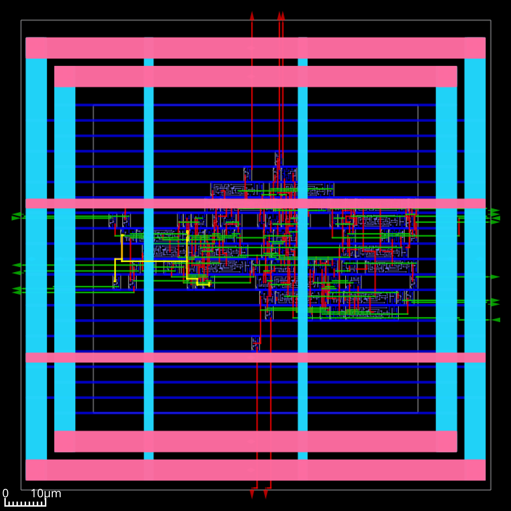

# Chapter 04 - OpenROAD first run

## Doing this chapter

- This chapter is mostly a training.
- We will try to get our first results (GDS files).
- There are example designs avaiable.
- You can start your own design.

## Download the OpenRoad Flow Scripts from github

I do a shallow clone of the git repository without the full history.

```
cd
git clone --depth 5 --branch vhdl --single-branch https://github.com/fredowski/OpenROAD-flow-scripts.git
```

This creates the local copy in the folder "OpenROAD-flow-scripts". The difference to the official repository from OpenROAD is the VHDL support that I added.

## The Makefile

Let's have a look into the Makefile first.

### The flow steps

The Makfile (in the ```/flow``` directory) contains all the flow steps in the same order we already have seen:


### DESIGN_CONFIG

The Makefile starts with the selection of the design to run.

Of interest for this course are the lines regarding to the IHP PDK:

```
#DESIGN_CONFIG=./designs/ihp-sg13g2/aes/config.mk
DESIGN_CONFIG=./designs/ihp-sg13g2/counter/config.mk
#DESIGN_CONFIG=./designs/ihp-sg13g2/ibex/config.mk
#DESIGN_CONFIG=./designs/ihp-sg13g2/gcd/config.mk
#DESIGN_CONFIG=./designs/ihp-sg13g2/murax/config.mk
#DESIGN_CONFIG=./designs/ihp-sg13g2/spi/config.mk
#DESIGN_CONFIG=./designs/ihp-sg13g2/riscv32i/config.mk
#DESIGN_CONFIG=./designs/ihp-sg13g2/i2c-gpio-expander/config.mk
```

The ```counter``` example is selected for the next run.

## The designs to run 

### counter - 16 bit modulo 65536 counter with enable (VHDL)

- The counter design is included with the OpenROAD-flow-script examples.
- It consists of only a single VHDL file, easy to read.
- The counter is a synchronous 16 bit modulo 65536 counter with enable 

###



###

counter files:

```
cd flow/designs/src/counter
ls -la
counter.vhd
```

```
cd flow/designs/ihp-sg13g2/counter
ls
config.mk
constraint.sdc
```

### Run the flow for counter

Adapt the Makefile by uncommenting the counter design. Run the full flow for the counter example

```
cd flow
make
```

Open the openroad gui to see the final layout

```
cd flow
make gui_final
```

### Check the results and reports

After each step the design database and reports are saved. The first step is the synthesis step from yosys that creates a verilog netlist with the standard cells. Check the netlist with:

```
cd flow/results/ihp-sg13g2/counter/base
open 1_2_yosys.v
```

The synthesis report for the example shows the required standard cells and the corresponding area.

```
cd flow/reports/ihp-sg13g2/counter/base
less synth_stat.txt
```

### gcd - greatest common divisor

- The gcd design is included with the OpenROAD-flow-script examples.
- It consists of only a single verilog file, easy to read.
- The gcd design computes the greatest common divisor of two numbers

###


###

gcd files:

```
cd flow/designs/src/gcd
ls
gcd.v
README.md
BUILD.bazel
```

```
cd flow/designs/ihp-sg13g2/gcd
ls
autotuner.json
config.mk                (important)
constraint.sdc           (important)
rules-base.json
```

### Run the flow for gcd

Adapt the Makefile by uncommenting the gcd design. Then run the full flow for the gcd example

```
cd flow
make
```

Open the openroad gui to see the final layout

```
cd flow
make gui_final
```

### Check the gcd results and reports

Check the synthesis netlist with:

```
cd flow/results/ihp-sg13g2/gcd/base
open 1_2_yosys.v
```

The synthesis report for example show the required standard cells and the corresponding area.

```
cd flow/reports/ihp-sg13g2/gcd/base
less synth_stat.txt
```

### ibex: RISC-V core

- The ibex design is included with the OpenROAD-flow-script examples.
- It consists of many Verilog files, not that easy to read.
- A single run might take more then 30 minutes

### 


###

ibex files:

```
src/ibex$ ls
ibex_alu.v                 ibex_ex_block.v         ibex_register_file_ff.v      prim_ram_1p.v
ibex_branch_predict.v      ibex_fetch_fifo.v       ibex_register_file_fpga.v    prim_secded_28_22_dec.v
ibex_compressed_decoder.v  ibex_icache.v           ibex_register_file_latch.v   prim_secded_28_22_enc.v
ibex_controller.v          ibex_id_stage.v         ibex_wb_stage.v              prim_secded_39_32_dec.v
ibex_core.v                ibex_if_stage.v         LICENSE                      prim_secded_39_32_enc.v
ibex_counter.v             ibex_load_store_unit.v  prim_badbit_ram_1p.v         prim_secded_72_64_dec.v
ibex_cs_registers.v        ibex_multdiv_fast.v     prim_clock_gating.v          prim_secded_72_64_enc.v
ibex_csr.v                 ibex_multdiv_slow.v     prim_generic_clock_gating.v  prim_xilinx_clock_gating.v
ibex_decoder.v             ibex_pmp.v              prim_generic_ram_1p.v        README.md
ibex_dummy_instr.v         ibex_prefetch_buffer.v  prim_lfsr.v

```

###

```
ihp-sg13g2/ibex$ ls
autotuner.json  
config.mk  
constraint_doe.sdc  
constraint.sdc  
metadata-base-ok.json  
rules-base.json
```

### lfsr

- The lfsr design example must be created from scratch.
- The VHDL code is available in the lecture slides and should become a single file.
- The structure of other examples must be copied for this.
- The configuration files must be copied and adapted for this.
- A single run should be very short.

###


